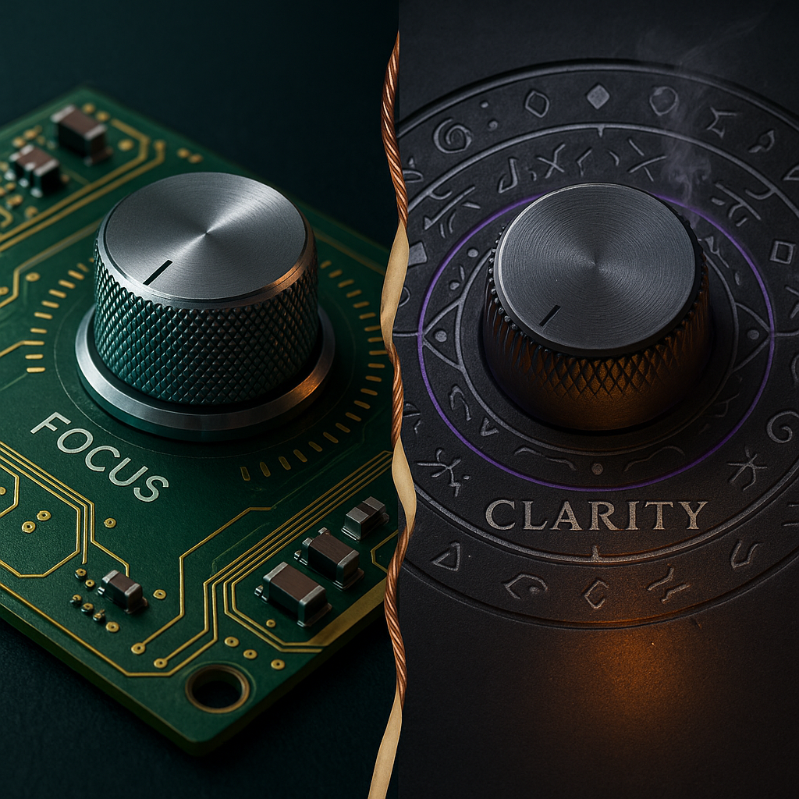

AI keeps slipping out of the "purely technical" box. It feels like casting. Power is available, but what arrives on the page depends on how you ask, how you aim, and how you hold the work while it is being shaped.

This frame was sparked by *A Practical Guide to Sorcery* by Azalea Ellis. In that world, raw power exists, but results hinge on the caster's Will, and on the link between what is done and what is desired. Swap wands for laptops. The pattern holds.

---

## Power is not the story

Yes, model size matters. It is the boring half. Power lets you lift the stone. It does not decide which stone to lift, why to lift it, or where to place it when you are done. If you feel stuck, more power mostly gives you louder mistakes.

---

## Will, in two parts

**Focus** is your usable attention. What you keep in mind. What you choose to omit. How small you make the target so you can actually hit it. Focus is the shape of the working memory, the discipline to narrow the lens, and the nerve to ignore the rest.

**Clarity** is outcome sharpness. What "done" means. What must be true at the end. The lines you will not cross. When the output looks slick but misses the point, that is not "AI being dumb." That is a clarity problem.

The two are linked. As clarity sharpens, focus can narrow. As focus narrows, clarity becomes cheaper to maintain. If either goes soft, the other gets expensive.

---

## Direction, or which school you cast from

There are two clean ways to direct power. Most useful work touches both, but it helps to name them.

**Transmutation** is the technical school. You move from substance to structure. You anchor to patterns, components, constraints, and proofs. In plain terms, you make things that can be checked.

**Transmogrification** is the semantic school. You move by metaphor and similarity. You shape tone, narrative, reference, and feel. In plain terms, you make things that can be felt.

Neither is superior. Both have obvious traps. Transmutation without imagination becomes rigid and small. Transmogrification without grounding becomes confident nonsense. Most real problems ask for the braid, not a single strand.

---

## The seam where good work happens

Strong outcomes tend to follow a simple rhythm. First, find something true enough to hold weight. Then, let it breathe into a form that people can actually absorb. Or if you think in stories first, sketch a form that pulls you forward, then let it meet something true and testable so it does not float away.

Do not let lack of technical depth limit your ambition. Do not let aesthetic taste erode the bones. Refuse the false choice.

---

## A small mental framework you can carry

* Power is cheap. Will is scarce.
* Will has two dials: focus and clarity.
* Direction has two schools: transmutation and transmogrification.
* The work is to keep the dials honest and to braid the schools on purpose.

That is it. No incantations to memorize. No twelve-step ritual. Just a way to notice what is actually missing when things wobble.

---

## Questions worth asking while you cast

* What must be true at the end, even if everything else changes
* What can be safely ignored right now
* What would this look like if I explained it to a skeptical friend
* What would this sound like if I said it to someone who might actually care
* Where does my preference for form or function risk blinding me

Not commandments. Just questions that keep the hands steady.

---

## Closing

If AI feels like magic, act like a responsible caster. Aim your power. Guard your attention. Say what you mean to make. And when the work asks you to choose a school, remember you do not have to. You can change houses mid-spell.

**Which school of wizardry are you in today, and when do you switch?**
